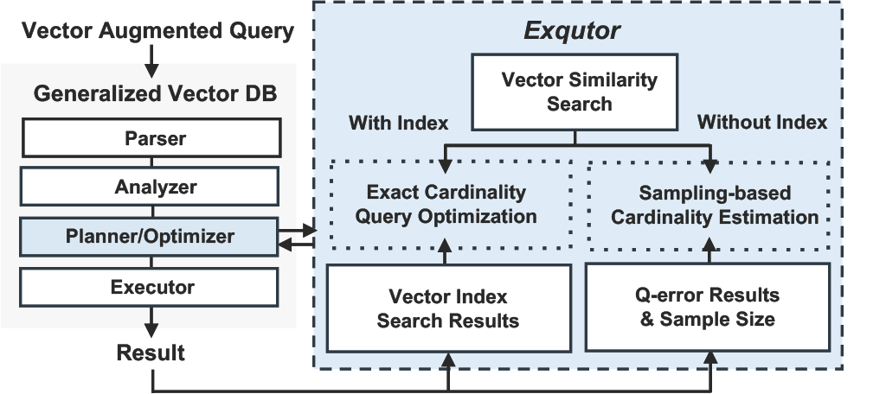
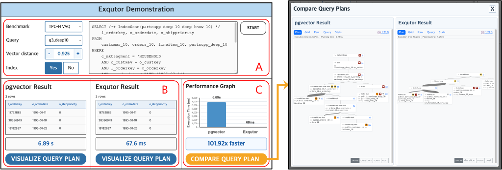

<div align="center">
  <h1>Towards Improved Cardinality-Based Optimization for Vector-Augmented Queries with Exqutor </h1>
</div>

In this repository, we demonstrate **Exqutor**, an open-source framework for improving the performance of **vector-augmented queries (VAQs)** in generalized vector database management systems. This work is based on our paper accepted at ICDE'26 ([Paper link](https://arxiv.org/abs/2512.09695)).

<br>
<div align="center">
    
</div>
<br>


VAQs combine **vector similarity search (VSS)** with relational operators such as **joins** and **filters**. However, existing query optimizers often treat vector predicates as black-box operators and rely on fixed or heuristic selectivity estimates, which can lead to inefficient query plans.

Exqutor addresses this problem by integrating **cardinality estimation for vector predicates directly into the query planning phase**. It supports two complementary techniques:

- **Exact Cardinality Query Optimization (ECQO)**: performs lightweight vector index probes during planning to compute exact predicate cardinalities.
- **Adaptive Sampling-Based Estimation**: approximates predicate cardinalities when vector indexes are unavailable.

By replacing heuristic selectivity with computed cardinalities in the optimizer cost model, Exqutor enables more efficient query plans **without modifying the execution engine or SQL interface**.

## What This Demo Shows

This demo allows users to interactively explore how Exqutor improves query planning for vector-augmented queries.

<br>
<div align="center">
    
</div> <br>

Specifically, the demo highlights:

- **Query plan comparison** between pgvector and Exqutor
- **Vector distance threshold sensitivity** for vector predicates
- **Two complementary techniques for vector predicate cardinality estimation**: Exact Cardinality Query Optimization (ECQO) and adaptive sampling-based estimator

## Running the Demo

To run the demonstration, first navigate to the `demo_web` directory:

```sh
cd demo_web
```

Then launch the demo application:

```sh
python app.py
```

Once the application is running, access the demo interface through the local endpoint specified by the server configuration in `app.py`.
